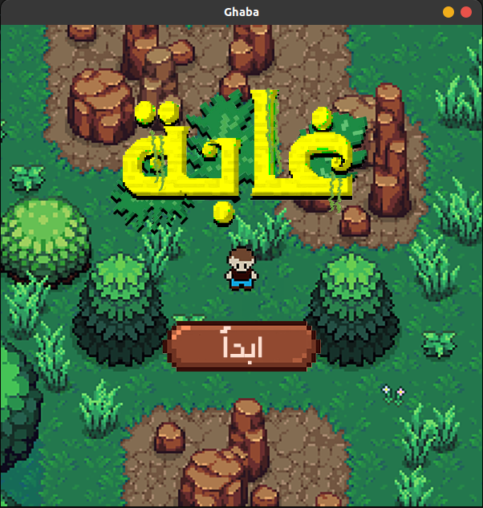
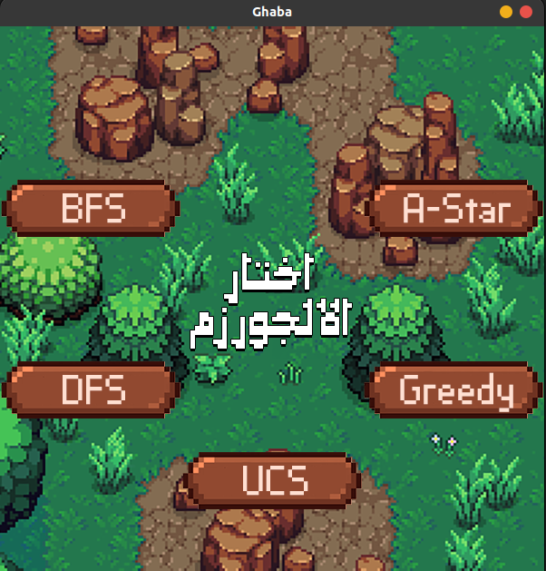
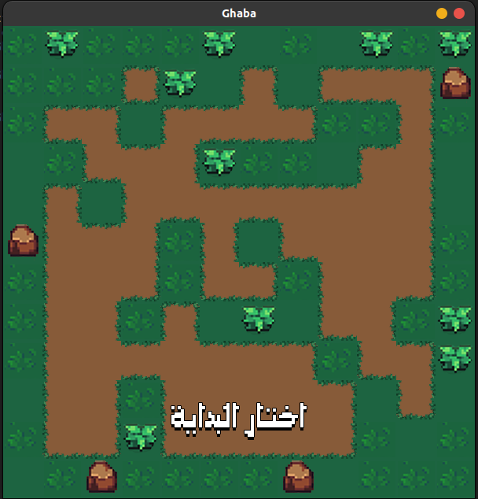
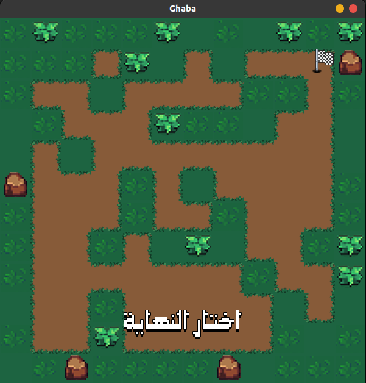
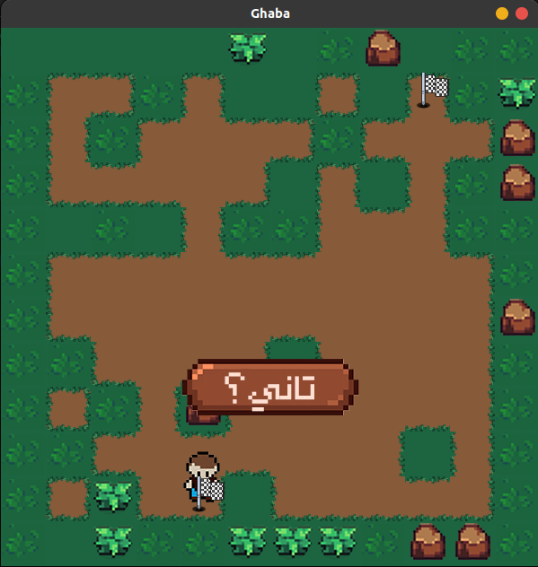

# Description

A gamified maze solver using search algorithms built using PyGame.

**Algorithms Used:**

- Breadth First Search
- Depth First Search
- Uniform Cost Search
- Greedy 
- A* 

# Screenshots

  
*Game Intro*

  

  
*Algorithms Menu*

  

  
*Choosing the start point*

  

  
*Choosing the end point*

  

  
*The player has arrived!*
